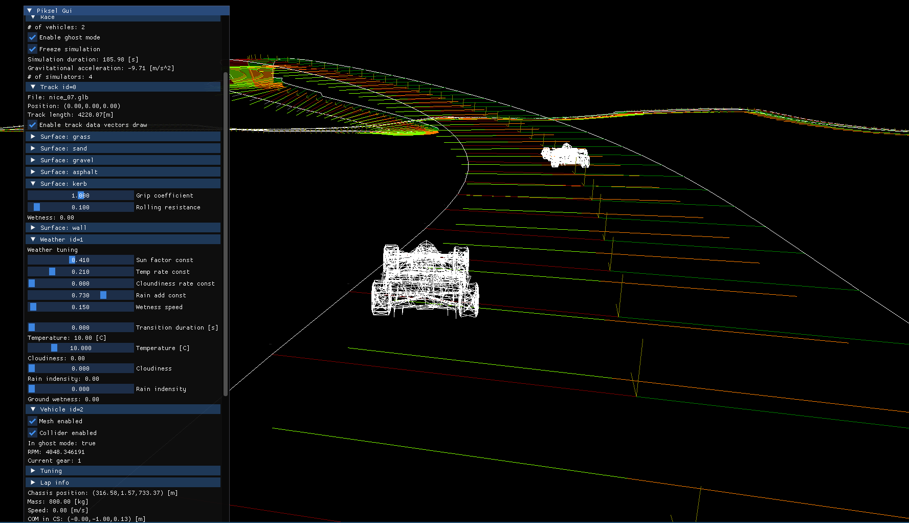

# Boink

Boink is a simple physics engine focused on vehicle simulation.



## Dependencies

Boink uses:

* [Bullet3](https://github.com/bulletphysics/bullet3)
* [tinygltf](https://github.com/syoyo/tinygltf)
* [Piksel](https://github.com/piksel-lib/piksel)
* [spdlog](https://github.com/gabime/spdlog)

## Build

```bash
git clone https://github.com/INIT-SGGW/HackArena3.0-Physics-Engine
cd boink

mkdir build
cd build

cmake --preset release
cmake --build build/release
```

## License
Copyright (c) 2026 Koło naukowe \_\_init\_\_

Boink is licensed under the GNU GPL v3.0.

## Third party licenses
See the THIRD_PARTY_LICENSES.txt file for full details.
* Bullet3 — zlib License
* tinygltf — MIT License
* Piksel — MIT License
* spdlog — MIT License
